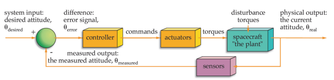

#### 9. Classification of spacecraft by their design features

按照设计特点或特性对航天器进行分类；

##### referred

* [航天器-wikipedia](https://zh.wikipedia.org/wiki/%E8%88%AA%E5%A4%A9%E5%99%A8)
* [航天器-百度百科](https://baike.baidu.com/item/%E8%88%AA%E5%A4%A9%E5%99%A8/3514266)
* [Spacecraft classification by NASA](https://www.nasa.gov/audience/forstudents/postsecondary/features/F_Spacecraft_Classification.html)

航天器根据是否载人分为[无人航天器](https://zh.wikipedia.org/wiki/无人航天器)和[载人航天器](https://zh.wikipedia.org/wiki/载人航天器)。无人航天器根据是否环绕地球运行则被分为[人造卫星](https://zh.wikipedia.org/wiki/人造地球卫星)和[空间探测器](https://zh.wikipedia.org/wiki/空间探测器)。按照航天器的用途和结构形式，还可以将它们进一步进行细分。**如下图**：
$$
航天器
\begin{cases}
	无人航天器
	\begin{cases}
		人造地球卫星
		\begin{cases}
			科学卫星\\
			应用卫星\\
			技术试验卫星
		\end{cases}\\
		空间探测器
		\begin{cases}
			月球探测器\\
			行星和星际探测器
		\end{cases}\\
	\end{cases}\\
	载人航天器
	\begin{cases}
		空间站\\
		航天飞机\\
		空天飞机\\
		货运飞船\\
		载人飞船
		\begin{cases}
		卫星式载人飞船\\
		登月载人飞船\\
		行星际载人飞船
		\end{cases}
	\end{cases}\\
\end{cases}
$$

航天器分为军用航天器、民用航天器和军民两用航天器，这三种航天器都可以分为无人航天器和载人航天器。 无人航天器分为人造地球卫星、空间探测器和货运飞船。 载人航天器分为载人飞船、空间站和航天飞机、空天飞机。 人造地球卫星分为科学卫星、技术试验卫星和应用卫星。

NASA's classification:

1. Flyby spacecraft 
2. Orbiter spacecraft 
3. Atmospheric spacecraft 
4. Lander spacecraft 
5. Rover spacecraft 
6. Penetrator spacecraft 
7. Observatory spacecraft 
8. Communications spacecraft

按照是否载人分为载人和无人；按设计特点则最好**按NASA分为7类**；

##### answer

a diagram is recommended for illustrating.

spacecrafts can be divided into two groups, manned spacecraft and unmanned spacecraft; 

| Spacecraft             | Functions                                                    |
| ---------------------- | ------------------------------------------------------------ |
| Flyby Spacecraft       | conducted the initial reconnaissance phase of solar system exploration |
| Orbiter Spacecraft     | travel to a distant planet and enter into orbit about it     |
| Atmospheric Spacecraft | a relatively short mission to collect data about the atmosphere of a planet or satellite |
| Lander Spacecraft      | reach the surface of a planet and survive long enough to telemeter data back to Earth |
| Penetrator Spacecraft  | entering the surface of a body, such as a comet, surviving an impact of hundreds of Gs, measuring, and telemetering the properties of the penetrated surface |
| Rover Spacecraft       | taking images and soil analyses to collecting samples for return to Earth |
| Observatory Spacecraft | occupies an Earth orbit or a solar orbit from where it can observe distant targets free of the obscuring and blurring effects of Earth's atmosphere |

#### 10. Magnetic stabilization of the spacecraft

航天器的磁稳定；

##### referred

* [Active Magnetic Control System for Gravity Gradient Stabilized Spacecraft](https://digitalcommons.usu.edu/cgi/viewcontent.cgi?article=2389&context=smallsat), [abstract](https://digitalcommons.usu.edu/smallsat/1988/all1988/19/)
* [Global Magnetic Attitude Control of Spacecraft in the Presence of Gravity Gradient](https://spiral.imperial.ac.uk/bitstream/10044/1/653/1/Global%20magnetic%20attitude%20control.pdf)
* [Fully magnetic attitude control for spacecraft subject to gravity gradient](https://www.sciencedirect.com/science/article/abs/pii/S0005109899000217)
* [微小卫星姿态磁控制及三轴被动稳定研究](https://cdmd.cnki.com.cn/Article/CDMD-90002-2003097690.htm)

The addition of active magnetic control to a gravity gradient stabilized system appears as a means to  increase the system capabilities and performance while improving the overall cost trade-offs. An active  magnetic control system can provide very effective, rapid and tighter damping, and replace the passive  dampers. It does not require any moving parts; it can provide for automatic initial acquisition and  stabilization of the spacecraft in a spin control mode after launch; it can be used for attitude and angular rate  measurements and automatic gravity gradient capture; the magnetic torqueing capabilities can be used for  reversal for the spacecraft when necessary, and provide the capability for arbitrary control of the spacecraft  yaw angle.  

In addition such an active control system allows a relaxation of the requirements on the gravity gradient  boom; the boom does not need to be retractable and its thermal characteristics are less critical.  

The understanding of the advantages of such system led to detailed studies of adequate attitude determination  and control algorithms for its implementation. These algorithms were specifIed to provide for attitude  determination, automatic libration damping, and arbitrary yaw control with instrumentation limited to a  three-axis magnetometer, three magnetic torquers, and a control microprocessor.

This document discusses the results of the study of the application of an active magnetic control to gravity  gradient stabilized satellites conceived for a multiple satellite system. In the first part, the system and the  control method are described and analyzed. The results of realistic simulations are then presented and  discussed. Finally, the general description of a possible method for autonomous deployment sequence of  the spacecraft is presented. 

##### answer

==答案有不确定性，网上没有找到完全准确的回答==，磁控制方法似乎广泛出现在2010年前，按理说应用应该比较广，但在Google scholar和百度上资料不多，且国内相关论文影响因子很低；

An active  magnetic control system can provide very effective, rapid and tighter damping, and replace the passive  dampers.

Magnetic control can provide for automatic initial acquisition and  stabilization of the spacecraft in a spin control mode after launch.

Such actuators operate on the basis of the interaction between the geomagnetic field and a set of three orthogonal current-driven coils.

#### 11. The structure of the main compartments of the spacecraft

翻译是航天器主隔室的结构，但并不知道这是个什么东西；猜测main compartments大概致主要载人舱或载货舱；

##### referred

* [ SPACECRAFT SYSTEMS](http://www.braeunig.us/space/systems.htm)
* [SPACECRAFT DESIGN, STRUCTURE AND OPERATIONS ](https://www.globalsecurity.org/space/library/report/2003/spacecraft_design_structure_ops.pdf)

##### answer

按照system组成回答；

* Structural Subsystem
* Power Supply and Distribution
* Telecommunications
* Data Handling
* Attitude and Articulation Control
* Propulsion Subsystems
* Pyrotechnic Subsystems
* Environmental Subsystems
* Landing Subsystems
* Science Instruments

#### 12. Spacecraft airtight container design

航天器密闭设计；airtight container一般指密闭容器，结合应该为气密或密闭设计；

##### referred

* [NASA-sealed with care](https://www.nasa.gov/feature/glenn/2020/sealed-with-care-a-qa)
* [How Does NASA Make Modules Air Tight?](https://www.eclipseaviation.com/how-does-nasa-make-modules-air-tight/)

**Why are these docking seals important?**

**Pat:** *These seals prevent breathable air from escaping through the connection between the visiting spacecraft and the station. This connection is a heavily loaded somewhat dynamic structural interface and the seals must perform flawlessly during docking approach and while docked to the ISS. Because they’re orbiting 250-plus miles up, and the visiting spacecraft can stay docked months at a time, it’s critical that the seals have very low leakage to minimize the amount of make-up supply air needed to maintain cabin pressure on the laboratory.*

*The seal we developed is a little over four feet in diameter, which is large enough to allow the crew and some cargo to transfer from the visiting spacecraft to the station. The seal has two redundant sealing surfaces or interfaces and had to be narrow enough to fit in the limited space available on the docking interface. It also had to be strong and resilient to withstand the extreme environment of space. Through development testing on the ground, we were able to prove that our design leaked less air per day than what would fill a standard pop can (about 12 oz or 330 ml). That is a really low leak rate for a seal of that size that also has to survive the challenging environment of space.*

**What were some of the seal design challenges that had to be addressed?**

**Pat:** *We had to evaluate the seal at every possible condition – both environmental and mechanical – that it would experience during flight. We also had to look at reusability.*

*We chose to make the seal out of silicone, a rubber-like material that can withstand the extreme temperatures experienced in space. It also had to survive exposure to damaging ultraviolet rays that are more severe on orbit than on the ground, without the leak rate increasing significantly. The seal material also couldn’t be overly sticky so it wouldn’t adhere to the metal sealing surface on the station side of the connection.*

*We tested multiple, smaller versions of different designs first to make sure they met all the requirements before testing full-scale versions of the final seal design for the docking system. Prior to the flight with Space X, we also tested small prototype seals in space, including some that were on the station for more than 18 months. Those prototypes were exposed to the harsh environment of space and were then brought back for additional testing.*

##### answer

* airtight is not perfect. By using constant monitoring, the cabin loses 1 mm of its air every day. so the live-able atmosphere pressure is preserved, and leaks are identified;
* seals(usually rubber) prevent breathable air from escaping through the connection between spacecraft's cabins;
* Based on remarks, a 3 mm drill and two sealing pastes and sealant materials were used to put the seal on the holes

#### 13. General requirements for the spacecraft structure

航天器结构的基本要求；

##### referred

* [航天器结构-百度百科](https://baike.baidu.com/item/%E8%88%AA%E5%A4%A9%E5%99%A8%E7%BB%93%E6%9E%84/12612676)
* [Guidelines for Developing Spacecraft Structural Requirements](https://ntrs.nasa.gov/api/citations/20040085957/downloads/20040085957.pdf)

航天器结构是[航天器](https://baike.baidu.com/item/航天器/3514266)各个受力和支承构件的总成，一般分为卫星结构、[空间探测器](https://baike.baidu.com/item/空间探测器/2197594)结构、[载人飞船](https://baike.baidu.com/item/载人飞船/377970)结构和[航天飞机](https://baike.baidu.com/item/航天飞机/315272)结构。它的作用是安装、连接各种仪器设备和动力装置，满足它们所需要的环境要求，承受地面操作、发射、轨道飞行和返回地面时的外力，并保持航天器的完整性。对航天器结构的基本要求是重量小、可靠性高、成本低等，通常用结构质量比，即结构重量占航天器总重的比例来衡量航天器结构设计和制造的水平，这个比值越小表示水平越高。航天器任务的多样性决定航天器结构形式的多样性。

##### answer

* The space vehicle structure must be designed to accommodate the maximum positive and negative pressure differentials across the pressure shell;
* The design implementation approach is crucial to ensuring a solution that addresses the technical issues yet minimizes the operational impacts;
* Each program must individually weigh the hardware weight impact against the downstream recurring operational costs for the vehicle;
* The basic requirements for the structure of the spacecraft are less weight, high reliability, low cost, etc., and usually use the structure quality ratio, which is, the proportion of structural weights to measure the level of spacecraft structure design and manufacturing.

#### 14. Spacecraft unpressurized pallet structure

航天器无压舱结构，该问题的Deep L翻译为航天器无压托盘结构，建议取“航天器无压舱结构”，见下；

unpressurized pallet搜索结果比较少，推荐取[pallet](https://www.oxfordlearnersdictionaries.com/definition/english/pallet?q=pallet)的*a heavy wooden or metal base that can be used for moving or storing goods*意，则和cargo可以对上，参考下面这篇NASA的文献；

##### referred

* [Systems Analysis and Structural Design of an Unpressurized Cargo Delivery Vehicle](https://ntrs.nasa.gov/api/citations/20070017847/downloads/20070017847.pdf)

简称为`UCDV`；

##### answer

* Major components identified for the `UCDV` are the Unpressurized Cargo Delivery Module comprised of a core structure and two detachable cargo pallets holding the `ORUs`, an aerodynamic nose cone, and a Service Module to provide on-orbit propulsion and power for the `UCDM`. 
* `UCDM` is composed of Passive Payload Attach Structure, Flight Releasable Grapple Fixture, Cargo Pallet, Avionics Bay, Core Structure, Orbital Replacement Unit, and Flight Releasable Attachment Mechanism.

#### 15. Flight control system of the spacecraft

航天器的飞控；（题目很大）

##### referred

* [Space Vehicle Control Systems](https://www.faa.gov/about/office_org/headquarters_offices/avs/offices/aam/cami/library/online_libraries/aerospace_medicine/tutorial/media/III.4.3.1_Space_Vehicle_Control_Systems.pdf)
* [Space Shuttle Digital Flight Control System](https://ntrs.nasa.gov/api/citations/19760024058/downloads/19760024058.pdf)

分为高度和姿态控制；

##### answer

On space vehicles, control systems are an integral part of virtually all payloads and subsystems;

Virtually all spacecraft payloads and subsystems rely on closed-loop systems to control：

* Momentum (angular and linear)—the job of attitude and orbit control subsystem (AOCS) 
* Imaging, communicating, and operating other missions—payloads
* Data (bits and bytes)—the job of communication and data-handling subsystem (CDHS) 
* Power (current, voltage, distribution)—controlled by the electrical power subsystem (EPS) 
* Internal environment (temperature, air, water, food, waste)—the job of environmental control and life-support subsystem (ECLSS) 
* Loads (bending, twisting, shaking)—handled by structures and mechanisms 
* Rocket thrust (valves, pressure, temperature)—provided by the propulsion subsystem

#### 16. Schematic design of the spacecraft

航天器的示意图设计；航天器的原理设计；

应该是属于航天器设计步骤之一；

##### referred

* [Preliminary Design Phase](https://www.lawinsider.com/clause/spacecraft-preliminary-design-review-spdr)

##### answer

* [Upon receipt](https://www.lawinsider.com/clause/spacecraft-preliminary-design-review-spdr) of written authorization, the Architect/Engineer, using the approved Schematic Design Documents, shall prepare the Preliminary Design Documents. 
* The development of the Preliminary Design Documents shall be responsive to the comments received from the Trustees during the Schematic phase.

#### 17. Basic stages of spacecraft design

航天器设计的步骤；

##### referred

* [The Spacecraft Design Process](https://www.fossilhunters.xyz/spaceflight/the-spacecraft-design-process.html)

##### answer

| Stage                                           | Description                                                  |
| ----------------------------------------------- | ------------------------------------------------------------ |
| Preliminary design and feasibility              | Creation of a preliminary spacecraft design, and months project plan in terms of schedule and cost; the identification of the key technology areas that may threaten feasibility |
| Detailed design                                 | Conversion of the preliminary design into a months baseline technical solution, including detailed system and subsystem designs; development of a detailed program for subsequent phases |
| Development, manufacture, integration, and test | Development and manufacture of flight years hardware; integration of spacecraft, and extensive ground testing |
| Flight operations                               | Orbital Delivery of spacecraft to launch site; launch lifetime campaign; early orbit operations; mission orbit operations; end-of-life disposal from mission orbit |

