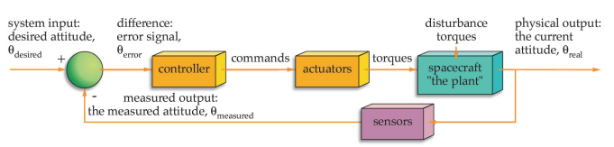

# MAI's exam before enrolling in
Space Engineering Master program for SJTU-MAI, focusing on Information and Control.

Actually Spacecraft Engineering Master's degree.

* host: ZHLiu25(same as `jaccount`)
* class: 22M03

[2022 questions](Master's - Spacecraft Engineering.pdf) can be referred here;

#### 1. The definition of a spacecraft

航天器的定义；

##### referred

* [spacecraft-wikipedia](https://en.wikipedia.org/wiki/Spacecraft)
* [航天器-wikipedia](https://zh.wikipedia.org/wiki/%E8%88%AA%E5%A4%A9%E5%99%A8)
* [航天器-百度](https://baike.baidu.com/item/%E8%88%AA%E5%A4%A9%E5%99%A8/3514266)

A **spacecraft** is a vehicle or machine designed to [fly in outer space](https://en.wikipedia.org/wiki/Spaceflight). A type of [artificial satellite](https://en.wikipedia.org/wiki/Artificial_satellite), spacecraft are used for a variety of purposes, including [communications](https://en.wikipedia.org/wiki/Telecommunications), [Earth observation](https://en.wikipedia.org/wiki/Earth_observation_satellite), [meteorology](https://en.wikipedia.org/wiki/Weather_satellite), [navigation](https://en.wikipedia.org/wiki/Navigation), [space colonization](https://en.wikipedia.org/wiki/Space_colonization), [planetary exploration](https://en.wikipedia.org/wiki/Planetary_science), and [transportation](https://en.wikipedia.org/wiki/Space_transport) of [humans](https://en.wikipedia.org/wiki/Human_spaceflight) and [cargo](https://en.wikipedia.org/wiki/Cargo_spacecraft). All spacecraft except [single-stage-to-orbit](https://en.wikipedia.org/wiki/Single-stage-to-orbit) vehicles cannot get into space on their own, and require a [launch vehicle](https://en.wikipedia.org/wiki/Launch_vehicle) (carrier rocket).

**航天器**又名**太空载具**、**航天器**或**空天飞船**，是在[地球](https://zh.wikipedia.org/wiki/地球)[大气层](https://zh.wikipedia.org/wiki/大气层)以外的[宇宙空间](https://zh.wikipedia.org/wiki/宇宙空間)中，基本按照[天体力学](https://zh.wikipedia.org/wiki/天体力学)的规律运动的各种[飞行器](https://zh.wikipedia.org/wiki/飞行器)[[1\]](https://zh.wikipedia.org/wiki/航天器#cite_note-1)。航天器与自然[天体 ](https://zh.wikipedia.org/wiki/天体)的不同之处在于其可以受控改变其运行轨道或进行回收。常见的航天器包括[人造卫星](https://zh.wikipedia.org/wiki/人造卫星)、[空间探测器](https://zh.wikipedia.org/wiki/空间探测器)、[航天飞机](https://zh.wikipedia.org/wiki/航天飞机)和各种[空间站](https://zh.wikipedia.org/wiki/空间站)等。航天器要完成其任务必须具备[发射场](https://zh.wikipedia.org/wiki/发射场)、运载器、航天测控系统、数据采集系统、用户站台以及回收设施等的配合。如果需要载人，更需要携带维生资源、生命维持系统、成员观察训练程序的协助。[V2火箭](https://zh.wikipedia.org/wiki/V2火箭)可算是世界上第一个航天器。

##### answer

Spacecrafts are a variety of vehicles that move in space beyond the Earth's atmosphere, basically in accordance with the laws of celestial mechanics.;

Spacecrafts are divided into manned spacecraft and unmanned spacecraft;

purposes includes communications, Earth observation, meteorology, navigation, space colonization, planetary exploration and transportation of humans and cargo.

> Spacecraft, also known as space vehicles and space vehicles. A type of vehicle that operates in space according to the laws of celestial mechanics and performs specific tasks such as the exploration, exploitation and use of space and celestial bodies.

#### 2. Assessment of energy costs for orbit-to-orbit manoeuvres

评估变轨机动的能量消耗；

Current spacecraft have opted for a solar sail and battery pack as standard, with the solar sail falling under the energy acquisition component, which can also be called a power generator. Other means of energy acquisition include chemical energy and emissive energy. External energy is influenced by the environment, so the design of the sail is very different depending on the orbit and the light. Chemical and nuclear energy are internal energy generators. Early satellites and small satellites with very low lifetime requirements (e.g. Cubesats) used chemical batteries, which account for about 5% of the total spacecraft.

#### 3. Main specifications of the spacecraft

#### 4. Propulsion system in the spacecraft structure

A spacecraft propulsion system is a device that uses the reaction principle to provide thrust for a vehicle, the propulsion system includes the engine and its auxiliary systems, for launch vehicles, the spacecraft propulsion system is a separate subsystem, customarily referred to as the engine

#### 5. Classification of spacecraft by application and purpose

#### 6. Truss-type spacecraft

桁架型航天器；

For the spacecraft truss structure, the top-down design mode is used to establish the truss system from top to bottom. The top-down skeleton model is used as an information transfer carrier to transform the functional planning of the product into product design requirements by abstracting the general layout, external references, etc. and constructing the spatial geometry in the conceptual design stage, reflecting the spatial layout and topological relationships of the product&], thus making the product design clear and facilitating the establishment of the design model; secondly, based on the top-down information transfer and inheritance, the design intent and constraints can fully penetrate the whole system, complemented by the parametric design and change of the product driven by the skeleton model. Secondly, based on the top-down information transfer and inheritance, the design intention and constraints can be fully penetrated through the whole system, supplemented by the skeleton model-driven product parametric design and change, which can easily achieve the adjustment and modification of the lower level design by adjusting the basic skeleton of the upper level, without affecting the assembly relationship of the whole product, reducing the risk of failure of the design model iteration update.

#### 7. The structure of the main spacecraft systems

Spacecraft consist of a number of subsystems with different functions. These systems can generally be divided into two main categories: dedicated systems and support systems. Dedicated systems are used for the direct execution of specific spaceflight missions; assurance systems are similar for all types of spacecraft and generally include structural systems, thermal control systems, power systems, attitude and orbit control systems, life support systems and return to landing systems.

#### 8. Aerodynamic stabilization of the spacecraft

An aircraft is said to be stable when it can regain its smoothness after a disturbance. Stability is also divided into static stability and dynamic stability. Static stability is the force or moment that restores the object to its pre-disturbance state after the disturbance is removed; dynamic stability is the gradual stopping of the object's disturbed motion after the disturbance is removed.

#### 9. Classification of spacecraft by their design features

按照设计特点或特性对航天器进行分类；

##### referred

* [航天器-wikipedia](https://zh.wikipedia.org/wiki/%E8%88%AA%E5%A4%A9%E5%99%A8)
* [航天器-百度百科](https://baike.baidu.com/item/%E8%88%AA%E5%A4%A9%E5%99%A8/3514266)
* [Spacecraft classification by NASA](https://www.nasa.gov/audience/forstudents/postsecondary/features/F_Spacecraft_Classification.html)

航天器根据是否载人分为[无人航天器](https://zh.wikipedia.org/wiki/无人航天器)和[载人航天器](https://zh.wikipedia.org/wiki/载人航天器)。无人航天器根据是否环绕地球运行则被分为[人造卫星](https://zh.wikipedia.org/wiki/人造地球卫星)和[空间探测器](https://zh.wikipedia.org/wiki/空间探测器)。按照航天器的用途和结构形式，还可以将它们进一步进行细分。**如下图**：
$$
航天器
\begin{cases}
	无人航天器
	\begin{cases}
		人造地球卫星
		\begin{cases}
			科学卫星\\
			应用卫星\\
			技术试验卫星
		\end{cases}\\
		空间探测器
		\begin{cases}
			月球探测器\\
			行星和星际探测器
		\end{cases}\\
	\end{cases}\\
	载人航天器
	\begin{cases}
		空间站\\
		航天飞机\\
		空天飞机\\
		货运飞船\\
		载人飞船
		\begin{cases}
		卫星式载人飞船\\
		登月载人飞船\\
		行星际载人飞船
		\end{cases}
	\end{cases}\\
\end{cases}
$$

航天器分为军用航天器、民用航天器和军民两用航天器，这三种航天器都可以分为无人航天器和载人航天器。 无人航天器分为人造地球卫星、空间探测器和货运飞船。 载人航天器分为载人飞船、空间站和航天飞机、空天飞机。 人造地球卫星分为科学卫星、技术试验卫星和应用卫星。

NASA's classification:

1. Flyby spacecraft 
2. Orbiter spacecraft 
3. Atmospheric spacecraft 
4. Lander spacecraft 
5. Rover spacecraft 
6. Penetrator spacecraft 
7. Observatory spacecraft 
8. Communications spacecraft

按照是否载人分为载人和无人；按设计特点则最好**按NASA分为7类**；

##### answer

a diagram is recommended for illustrating.

spacecrafts can be divided into two groups, manned spacecraft and unmanned spacecraft; 

| Spacecraft             | Functions                                                    |
| ---------------------- | ------------------------------------------------------------ |
| Flyby Spacecraft       | conducted the initial reconnaissance phase of solar system exploration |
| Orbiter Spacecraft     | travel to a distant planet and enter into orbit about it     |
| Atmospheric Spacecraft | a relatively short mission to collect data about the atmosphere of a planet or satellite |
| Lander Spacecraft      | reach the surface of a planet and survive long enough to telemeter data back to Earth |
| Penetrator Spacecraft  | entering the surface of a body, such as a comet, surviving an impact of hundreds of Gs, measuring, and telemetering the properties of the penetrated surface |
| Rover Spacecraft       | taking images and soil analyses to collecting samples for return to Earth |
| Observatory Spacecraft | occupies an Earth orbit or a solar orbit from where it can observe distant targets free of the obscuring and blurring effects of Earth's atmosphere |

#### 10. Magnetic stabilization of the spacecraft

航天器的磁稳定；

##### referred

* [Active Magnetic Control System for Gravity Gradient Stabilized Spacecraft](https://digitalcommons.usu.edu/cgi/viewcontent.cgi?article=2389&context=smallsat), [abstract](https://digitalcommons.usu.edu/smallsat/1988/all1988/19/)
* [Global Magnetic Attitude Control of Spacecraft in the Presence of Gravity Gradient](https://spiral.imperial.ac.uk/bitstream/10044/1/653/1/Global%20magnetic%20attitude%20control.pdf)
* [Fully magnetic attitude control for spacecraft subject to gravity gradient](https://www.sciencedirect.com/science/article/abs/pii/S0005109899000217)
* [微小卫星姿态磁控制及三轴被动稳定研究](https://cdmd.cnki.com.cn/Article/CDMD-90002-2003097690.htm)

The addition of active magnetic control to a gravity gradient stabilized system appears as a means to  increase the system capabilities and performance while improving the overall cost trade-offs. An active  magnetic control system can provide very effective, rapid and tighter damping, and replace the passive  dampers. It does not require any moving parts; it can provide for automatic initial acquisition and  stabilization of the spacecraft in a spin control mode after launch; it can be used for attitude and angular rate  measurements and automatic gravity gradient capture; the magnetic torqueing capabilities can be used for  reversal for the spacecraft when necessary, and provide the capability for arbitrary control of the spacecraft  yaw angle.  

In addition such an active control system allows a relaxation of the requirements on the gravity gradient  boom; the boom does not need to be retractable and its thermal characteristics are less critical.  

The understanding of the advantages of such system led to detailed studies of adequate attitude determination  and control algorithms for its implementation. These algorithms were specifIed to provide for attitude  determination, automatic libration damping, and arbitrary yaw control with instrumentation limited to a  three-axis magnetometer, three magnetic torquers, and a control microprocessor.

This document discusses the results of the study of the application of an active magnetic control to gravity  gradient stabilized satellites conceived for a multiple satellite system. In the first part, the system and the  control method are described and analyzed. The results of realistic simulations are then presented and  discussed. Finally, the general description of a possible method for autonomous deployment sequence of  the spacecraft is presented. 

##### answer

==答案有不确定性，网上没有找到完全准确的回答==，磁控制方法似乎广泛出现在2010年前，按理说应用应该比较广，但在Google scholar和百度上资料不多，且国内相关论文影响因子很低；

An active  magnetic control system can provide very effective, rapid and tighter damping, and replace the passive  dampers.

Magnetic control can provide for automatic initial acquisition and  stabilization of the spacecraft in a spin control mode after launch.

Such actuators operate on the basis of the interaction between the geomagnetic field and a set of three orthogonal current-driven coils.

#### 11. The structure of the main compartments of the spacecraft

翻译是航天器主隔室的结构，但并不知道这是个什么东西；猜测main compartments大概致主要载人舱或载货舱；

##### referred

* [ SPACECRAFT SYSTEMS](http://www.braeunig.us/space/systems.htm)
* [SPACECRAFT DESIGN, STRUCTURE AND OPERATIONS ](https://www.globalsecurity.org/space/library/report/2003/spacecraft_design_structure_ops.pdf)

##### answer

按照system组成回答；

* Structural Subsystem
* Power Supply and Distribution
* Telecommunications
* Data Handling
* Attitude and Articulation Control
* Propulsion Subsystems
* Pyrotechnic Subsystems
* Environmental Subsystems
* Landing Subsystems
* Science Instruments

#### 12. Spacecraft airtight container design

航天器密闭设计；airtight container一般指密闭容器，结合应该为气密或密闭设计；

##### referred

* [NASA-sealed with care](https://www.nasa.gov/feature/glenn/2020/sealed-with-care-a-qa)
* [How Does NASA Make Modules Air Tight?](https://www.eclipseaviation.com/how-does-nasa-make-modules-air-tight/)

**Why are these docking seals important?**

**Pat:** *These seals prevent breathable air from escaping through the connection between the visiting spacecraft and the station. This connection is a heavily loaded somewhat dynamic structural interface and the seals must perform flawlessly during docking approach and while docked to the ISS. Because they’re orbiting 250-plus miles up, and the visiting spacecraft can stay docked months at a time, it’s critical that the seals have very low leakage to minimize the amount of make-up supply air needed to maintain cabin pressure on the laboratory.*

*The seal we developed is a little over four feet in diameter, which is large enough to allow the crew and some cargo to transfer from the visiting spacecraft to the station. The seal has two redundant sealing surfaces or interfaces and had to be narrow enough to fit in the limited space available on the docking interface. It also had to be strong and resilient to withstand the extreme environment of space. Through development testing on the ground, we were able to prove that our design leaked less air per day than what would fill a standard pop can (about 12 oz or 330 ml). That is a really low leak rate for a seal of that size that also has to survive the challenging environment of space.*

**What were some of the seal design challenges that had to be addressed?**

**Pat:** *We had to evaluate the seal at every possible condition – both environmental and mechanical – that it would experience during flight. We also had to look at reusability.*

*We chose to make the seal out of silicone, a rubber-like material that can withstand the extreme temperatures experienced in space. It also had to survive exposure to damaging ultraviolet rays that are more severe on orbit than on the ground, without the leak rate increasing significantly. The seal material also couldn’t be overly sticky so it wouldn’t adhere to the metal sealing surface on the station side of the connection.*

*We tested multiple, smaller versions of different designs first to make sure they met all the requirements before testing full-scale versions of the final seal design for the docking system. Prior to the flight with Space X, we also tested small prototype seals in space, including some that were on the station for more than 18 months. Those prototypes were exposed to the harsh environment of space and were then brought back for additional testing.*

##### answer

* airtight is not perfect. By using constant monitoring, the cabin loses 1 mm of its air every day. so the live-able atmosphere pressure is preserved, and leaks are identified;
* seals(usually rubber) prevent breathable air from escaping through the connection between spacecraft's cabins;
* Based on remarks, a 3 mm drill and two sealing pastes and sealant materials were used to put the seal on the holes

#### 13. General requirements for the spacecraft structure

航天器结构的基本要求；

##### referred

* [航天器结构-百度百科](https://baike.baidu.com/item/%E8%88%AA%E5%A4%A9%E5%99%A8%E7%BB%93%E6%9E%84/12612676)
* [Guidelines for Developing Spacecraft Structural Requirements](https://ntrs.nasa.gov/api/citations/20040085957/downloads/20040085957.pdf)

航天器结构是[航天器](https://baike.baidu.com/item/航天器/3514266)各个受力和支承构件的总成，一般分为卫星结构、[空间探测器](https://baike.baidu.com/item/空间探测器/2197594)结构、[载人飞船](https://baike.baidu.com/item/载人飞船/377970)结构和[航天飞机](https://baike.baidu.com/item/航天飞机/315272)结构。它的作用是安装、连接各种仪器设备和动力装置，满足它们所需要的环境要求，承受地面操作、发射、轨道飞行和返回地面时的外力，并保持航天器的完整性。对航天器结构的基本要求是重量小、可靠性高、成本低等，通常用结构质量比，即结构重量占航天器总重的比例来衡量航天器结构设计和制造的水平，这个比值越小表示水平越高。航天器任务的多样性决定航天器结构形式的多样性。

##### answer

* The space vehicle structure must be designed to accommodate the maximum positive and negative pressure differentials across the pressure shell;
* The design implementation approach is crucial to ensuring a solution that addresses the technical issues yet minimizes the operational impacts;
* Each program must individually weigh the hardware weight impact against the downstream recurring operational costs for the vehicle;
* The basic requirements for the structure of the spacecraft are less weight, high reliability, low cost, etc., and usually use the structure quality ratio, which is, the proportion of structural weights to measure the level of spacecraft structure design and manufacturing.

#### 14. Spacecraft unpressurized pallet structure

航天器无压舱结构，该问题的Deep L翻译为航天器无压托盘结构，建议取“航天器无压舱结构”，见下；

unpressurized pallet搜索结果比较少，推荐取[pallet](https://www.oxfordlearnersdictionaries.com/definition/english/pallet?q=pallet)的*a heavy wooden or metal base that can be used for moving or storing goods*意，则和cargo可以对上，参考下面这篇NASA的文献；

##### referred

* [Systems Analysis and Structural Design of an Unpressurized Cargo Delivery Vehicle](https://ntrs.nasa.gov/api/citations/20070017847/downloads/20070017847.pdf)

简称为`UCDV`；

##### answer

* Major components identified for the `UCDV` are the Unpressurized Cargo Delivery Module comprised of a core structure and two detachable cargo pallets holding the `ORUs`, an aerodynamic nose cone, and a Service Module to provide on-orbit propulsion and power for the `UCDM`. 
* `UCDM` is composed of Passive Payload Attach Structure, Flight Releasable Grapple Fixture, Cargo Pallet, Avionics Bay, Core Structure, Orbital Replacement Unit, and Flight Releasable Attachment Mechanism.

#### 15. Flight control system of the spacecraft

航天器的飞控；（题目很大）

##### referred

* [Space Vehicle Control Systems](https://www.faa.gov/about/office_org/headquarters_offices/avs/offices/aam/cami/library/online_libraries/aerospace_medicine/tutorial/media/III.4.3.1_Space_Vehicle_Control_Systems.pdf)
* [Space Shuttle Digital Flight Control System](https://ntrs.nasa.gov/api/citations/19760024058/downloads/19760024058.pdf)

分为高度和姿态控制；

##### answer

On space vehicles, control systems are an integral part of virtually all payloads and subsystems;

Virtually all spacecraft payloads and subsystems rely on closed-loop systems to control：

* Momentum (angular and linear)—the job of attitude and orbit control subsystem (AOCS) 
* Imaging, communicating, and operating other missions—payloads
* Data (bits and bytes)—the job of communication and data-handling subsystem (CDHS) 
* Power (current, voltage, distribution)—controlled by the electrical power subsystem (EPS) 
* Internal environment (temperature, air, water, food, waste)—the job of environmental control and life-support subsystem (ECLSS) 
* Loads (bending, twisting, shaking)—handled by structures and mechanisms 
* Rocket thrust (valves, pressure, temperature)—provided by the propulsion subsystem

#### 16. Schematic design of the spacecraft

航天器的示意图设计；航天器的原理设计；

应该是属于航天器设计步骤之一；

##### referred

* [Preliminary Design Phase](https://www.lawinsider.com/clause/spacecraft-preliminary-design-review-spdr)

##### answer

* [Upon receipt](https://www.lawinsider.com/clause/spacecraft-preliminary-design-review-spdr) of written authorization, the Architect/Engineer, using the approved Schematic Design Documents, shall prepare the Preliminary Design Documents. 
* The development of the Preliminary Design Documents shall be responsive to the comments received from the Trustees during the Schematic phase.

#### 17. Basic stages of spacecraft design

航天器设计的步骤；

##### referred

* [The Spacecraft Design Process](https://www.fossilhunters.xyz/spaceflight/the-spacecraft-design-process.html)

##### answer

| Stage                                           | Description                                                  |
| ----------------------------------------------- | ------------------------------------------------------------ |
| Preliminary design and feasibility              | Creation of a preliminary spacecraft design, and months project plan in terms of schedule and cost; the identification of the key technology areas that may threaten feasibility |
| Detailed design                                 | Conversion of the preliminary design into a months baseline technical solution, including detailed system and subsystem designs; development of a detailed program for subsequent phases |
| Development, manufacture, integration, and test | Development and manufacture of flight years hardware; integration of spacecraft, and extensive ground testing |
| Flight operations                               | Orbital Delivery of spacecraft to launch site; launch lifetime campaign; early orbit operations; mission orbit operations; end-of-life disposal from mission orbit |

#### 18. Spacecraft crew life-support system

Life support system is a comprehensive equipment to maintain the atmospheric environment in the airtight cabin of manned spacecraft and ensure the safety, life and work of astronauts.

#### 19. The peculiarities of remote sensing spacecraft and weather observation spacecraft

Space optical remote sensing usually refers to the technology of detecting targets on the ground or celestial bodies from a high altitude of more than 100 kilometers above the ground to obtain relevant information

An artificial earth satellite that makes meteorological observations of the Earth and its atmosphere from space

#### 20. Pneumatic / hydraulic system of the spacecraft

It is often used to drive or control spacecraft to change attitude to complete specific tasks

#### 21. Pre-schematic design of the spacecraft

#### 22. The structure of the space system.

Earth-moon System The solar system The Milky Way

#### 23. The criteria for assessment of the designing process outcomes.

Innovation, science, practicability, feasibility and stability

#### 24. Ground tests of the spacecraft.

An experiment performed on the ground to simulate the space environment in order to test the reliability of a spacecraft in space

#### 25. Engineering requirements to the spacecraft design

对航天器的功能、限定的重量和尺寸、轨道精度、寿命、经济性和可靠性等的要求，多次使用的航天器还有重复使用的次数。

The function of the spacecraft, limited weight and size, orbit accuracy, life, economy and reliability requirements, repeated use of the spacecraft and the number of repeated use.

#### 26. Physical conditions of the space flight

发射时，靠火箭的推力由静止状态逐步加速到第一宇宙速度；变轨时，飞船可依靠喷火时的反推力作动力。

At launch, the thrust of the rocket is gradually accelerated from a stationary state to the first cosmic speed; When changing orbit, the spacecraft can rely on the back thrust of the fire for power.

#### 27. Features of the design of small and micro spacecraft

微小型航天器的功能密度高、研制成本低、载荷种类多、飞行任务灵活多样、性能指标千差万别。

Microspacecraft have high function density, low development cost, many kinds of payload, flexible and diverse mission, and different performance indexes.

#### 28. Features of interplanetary spacecraft

宇宙飞船可分为一次性使用与可重复使用两种类型。用[运载火箭](https://baike.baidu.com/item/运载火箭/786531)把飞船送入地球卫星轨道运行，然后再入[大气层](https://baike.baidu.com/item/大气层/247465)。飞船上除有一般人造卫星基本系统设备外，还有生命维持系统、重返地球的再入系统，回收登陆系统等。

Spacecraft can be divided into two types: single-use and reusable. A carrier rocket is used to put a spacecraft into orbit around an earth satellite and then re-enter the atmosphere. In addition to the general artificial satellite basic system equipment, there are life support system, re-entry system, recovery landing system and so on.

#### 29. Materials used for spacecraft structure. 

主要使用复合材料（如炭纤维）和金属材料（如铝合金）。

Composite materials (such as carbon fibers) and metallic materials (such as aluminum alloys) are mainly used.

#### 30. Preparation of the spacecraft for the launch. 

（1）.发射前在发射架上还要对运载火箭和飞船进行最后的测试，（2）.在发射架上对载人飞船上天后的状态进行设置，（3）.进行地面站测控设备的检测，（4）.发射前的气象保障条件，（5）.对候选航天员进行最后的心理测试。

(1) Before the launch, the carrier rocket and spacecraft should be tested on the launch pad, and (2). The state of the manned spacecraft after the launch is set on the launch pad, (3). The ground station measurement and control equipment is tested, (4). Meteorological support conditions before launch, (5). The final psychological test for astronaut candidates.

#### 31. Operational requirements for the spacecraft design. 

利用航天器的各种特性(如覆盖、失重、深空探索等特性)实现所需要的服务功能，如通信广播、导航定位、对地观测、科学研究、载人航天、深空探测等。

Various characteristics of spacecraft (such as coverage, weightlessness, deep space exploration, etc.) are used to achieve the required service functions, such as communication and broadcasting, navigation and positioning, earth observation, scientific research, manned spaceflight, deep space exploration, etc.

#### 32. The technical area of a cosmodrome.

航天器发射场是发射航天器的特定区域，通常由测试区、发射区、发射指挥控制中心、综合测量设施、各勤务保障设施和一些管理服务部门组成。

A spacecraft launch site is a specific area for launching spacecraft, which is usually composed of a test area, a launch area, a launch command and control center, comprehensive measurement facilities, various service support facilities and some management service departments.

SourceURL:file:///media/hazyparker/Data/Downloads/doc/MAIExam/33-40 answers.docx

#### **33. Gravitational control of the spacecraft.**

There is an electromagnetic factor of correlation between gravitational mass and inertial mass, which in specific electromagnetic conditions, can be reduced, made negative and increased in numerical value. This means that gravitational forces can be reduced, inverted and intensified by means of electromagnetic fields. Such control of the gravitational interaction can be applied to spacecraft by using devices based on gravity control, such as the gravitational motor and the quantum transceivers.

 

#### **34. Features of interplanetary spacecraft.**

Interplanetary spacecraft is the crewed or uncrewed vehicle traveling between stars and planets, which is confined between the planets of the Solar System in practice. 

Interplanetary spacecraft requires an extremely large amount of fuel to produce velocity changes required for its interplanetary journey into orbit. Other developments are designed to improve rocket launching and propulsion, as well as the use of non-traditional sources of energy. Using extraterrestrial resources for energy, oxygen, and water would reduce costs and improve life support systems. 

For crewed interplanetary spacecraft, life support systems must be capable of supporting human lives for extended periods of time and preventative measures are needed to reduce exposure to radiation and ensure optimum reliability.

 

#### **35. Scope and trends of space development.**

Space development is fueled by various purposes, such as space research (astronomy, space and earth observation), space transportation, communication, positioning, commercial use of space (Space tourism, space mining, space manufacturing), planetary defense, and space habitation.

Promising innovations and new space technology systems are coming of age, including small and micro satellites, mega-constellations of hundreds of satellites, small launchers, broadband and internet of- things from space, commercial human spaceflight, among the others.

Digitalization is creating new opportunities to industry, thanks to the introduction of lean manufacturing processes, vertical integration of end-to-end products and services, as well as with the first assembly lines for the mass production of small satellites. The development of 3D printed components for satellites and rockets are also becoming the norm for both large and small aerospace manufacturers.

 

#### **36. Characteristics of manned spacecraft.**

Manned spacecraft are designed to support human life for the human spaceflight portion of the mission, which include space capsules, spaceplanes, and space stations. Spacecraft for human spaceflight must have enough space in structure for human activities, and a human-rating certification as fit for purpose. Manned spacecraft must have a breathable atmosphere, pressurized (usually between 345 mbar and 1 bar); and be temperature-regulated (usually 20 to 24 °C). And manned spacecraft also has more critical requirement in safety and reliability than unmanned spacecraft.

 

#### **37. Global space market.**

The global space economy market in 2021 is valued at US$388.50 billion, and is likely to reach US$540.75 billion by 2026. According to the OCED, the space economy market can be defined as "the full range of activities and the use of resources that create value and benefits to human beings in the course of exploring, researching, understanding, managing and utilizing space". Globally, the space industry is growing, with a record number of countries and commercial enterprises engaging in space programs. 

As more research and exploration in the space has advanced, emerging concept of space tourism has set a positive remark in the market, with various private companies involving themselves to make the concept a reality in coming future.

More trends in the market is believed to grow the space economy market during the forecasted period, which may include growing demand for uninterrupted internet, the introduction of space resource utilization (SRU), the rapid increase in small satellites, micro and small launch operations, the development of in-space manufacturing, rapid technological advancement in asteroid mining, climbing demand for payload & telemetry data, the growing relationship between space and climate change, rising demand for earth observer (EO) data, and advancement in the interplanetary transportation system.

#### **38. Lagrange variational principle.**

Lagrange variational principle is a variational integral principle in the dynamics of holonomic systems restricted by ideal stationary constraints and occurring under the action of potential forces that do not explicitly depend on time.

According to Lagrange's principle, in a real motion of a holonomic system for which the energy integral  exists, between a certain initial position  and a final position , the Lagrange action

 

has a stationary value in comparison with the kinematically possible motions between these positions with the same energy  as in the real motion. Here  and  are the kinetic and the potential energy of the system,  is the amount of motion (momentum) of the - th point of the system and  and  are the instants when the system passes through the positions  and .

If the initial and final positions of the system are sufficiently close to one another, then the Lagrange action has a minimum for a real motion; in this connection the Lagrange principle is also called the principle of least action in Lagrange's form.

The Lagrange principle reduces the problem of determining a real motion of the system to the variational Lagrange problem; it expresses a condition that is necessary and sufficient for a real motion

 

#### **39. Internal force factors, differential relationship in torsion.**

Internal forces are the forces that act from within a body. Internal forces may generate acceleration in various system areas but may not cause acceleration in the system's center of mass. The potential or kinetic energy of the object is converted to mechanical energy by internal activities.

The internal force can be divided into 5 types: compression, tension, torsion, bending and shear.

The dipole moments, internal heat of the system, emissivity, temperature of the system and its surroundings, composition, weight, density, geometry of the system, moment of inertia, static moment, strain coefficient, module elasticity of the material and other factors all influence the internal forces within the system.

Torsion is the twisting of an object due to an applied torque. For shafts of uniform cross-section unrestrained against warping, the torsion is:

 

Where  is the applied torque or moment of torsion, is the maximum shear stress at the outer surface,  is the torsion constant for the section,  is the perpendicular distance between the rotational axis and the farthest point in the section,  is the length of the object to or over which the torque is being applied,  is the angle of twist in radians, and  is the shear modulus.

 

#### 40. Characteristics of unmanned spacecraft

Unmanned spacecraft are spacecraft without people on board, used for robotic spaceflight. The most common uncrewed spacecraft categories are robotic spacecraft, unmanned resupply spacecraft, space probed space observatories. Uncrewed spacecraft may have varying levels of autonomy from human input; they may be remote controlled, remote guided or even autonomous. 

SourceURL:file:///media/hazyparker/Data/Downloads/doc/MAIExam/41-48.docx

#### 41. Loads affecting the spacecraft 

详见群内文件：41.Spacecraft Design Loads.pdf

来源：[https://link.springer.com/chapter/10.1007/978-3-540-75553-1_6#copyright-information](#copyright-information)

 

#### 42. Castigliano variational principle

Castigliano’s theorem is a method for calculating the displacements of a linear-elastic system using partial derivatives of energy,which is well-known for two theorems.

Castigliano’s First theorem:The first partial derivative of the total internal energy (strain energy) in a structure with respect to any particular deflection component at a point is equal to the force applied at that point and in the direction corresponding to that deflection component.

Castigliano’s Second theorem:The first partial derivative of the total internal energy in a structure with respect to the force applied at any point is equal to the deflection at the point of application of that force in the direction of its line of action. 

来源：https://www.hpdconsult.com/what-is-castiglianos-theorem/

数学表示：

 

来源：https://www.docin.com/p-522885437.html

 

#### 43. Thin-walled closed section beam torsion

For closed sections, the shear stress is uniformly distributed through the thickness of the wall. The torsional stiffness  is proportional to the square of the enclosed area for a closed section. Consider, for instance, a thin ring of circular shape of mean radius  and thickness t. The torsional stiffness of the closed section denoted . If the section is subjected to the torque M, the maximum shear stresses in the closed section denoted . 

来源：[https://holooly.com/solutions/comparison-of-open-and-closed-thin-walled-sections/#:~:text=For%20a%20typical%20thin-walled%20beam%20with%20R_%20%7Bm%7D%3D20t,times%20larger%20than%20that%20of%20the%20closed%20section.](#:~:text=For a typical thin-walled beam with R_ {m}=20t,times larger than that of the closed section.)

 

#### 44. Features of the communications spacecraft

The communication system is an essential part of a spacecraft, enabling spacecraft to transmit data and telemetry to Earth, receive commands from Earth, and relay information to one another. A communications system consists of the ground segment: one or more ground stations located on Earth, and the space segment: the spacecraft(s) and their respective communication payloads. The three functions of a communications system are receiving commands from Earth (uplink), transmitting data down to Earth (downlink) and transmitting or receiving information from another satellite (crosslink or inter-satellite link). There are two types of communication systems: radio frequency (RF) and free space optical (FSO) also referred to as laser communications (lasercom).

来源：[https://www.nasa.gov/smallsat-institute/sst-soa/communications#9.7](#9.7)

 

#### 45. Detailed design of the spacecraft

详见群内文件：45.Spacecraft design _ Detailed Pedia.pdf（网页快照）

来源：https://www.detailedpedia.com/wiki-Spacecraft_design

 

#### 46. Least work principle

我怀疑它想问的是Principle of least action。

关于Least work principle，他的定义是The theory that geomorphological processes always operate in such a way as to achieve the work that has to be done with a minimum expenditure of energy (and maximum entropy). This is typically achieved by the adoption of a certain profile or shape (e.g. a river meander may be that shape best suited for carrying the discharge and sediment with the least loss of energy).这好像是个地质学的概念。

来源：https://www.oxfordreference.com/view/10.1093/oi/authority.20110803100056459

关于Principle of least action:

The principle of least action is the basic variational principle of particle and continuum systems. In Hamilton's formulation, a true dynamical trajectory of a system between an initial and final configuration in a specified time is found by imagining all possible trajectories that the system could conceivably take, computing the action (a functional of the trajectory) for each of these trajectories, and selecting one that makes the action locally stationary (traditionally called "least"). True trajectories are those that have least action. 

来源：http://www.scholarpedia.org/article/Least-action_principle

 

#### 47. Thin-walled open section beam torsion

For open sections, the shear stress is linear distributed through the thickness of the wall. The torsional stiffness  is proportional to the cube of the thickness for a open section. Consider, for instance, a thin-walled open circular tube of mean radius  and thickness t. The torsional stiffness of the open section denoted . If the section is subjected to the torque M, the maximum shear stresses in the open section denoted . 

来源：[https://holooly.com/solutions/comparison-of-open-and-closed-thin-walled-sections/#:~:text=For%20a%20typical%20thin-walled%20beam%20with%20R_%20%7Bm%7D%3D20t,times%20larger%20than%20that%20of%20the%20closed%20section.](#:~:text=For a typical thin-walled beam with R_ {m}=20t,times larger than that of the closed section.)

 

#### 48. Rayleigh-Ritz-Timoshenko method

The Rayleigh–Ritz method enables one to reduce an infinite number of degrees-of-freedom of a system into a finite number, which makes analysis possible and easier. The method relies on the approximation of the possible deformation shapes of the system, following the basic idea beyond Rayleigh's principle. A proper combination of these deformation shapes is supposed to reproduce roughly the expected overall vibration pattern and natural frequencies. 

来源：[https://www.sciencedirect.com/topics/engineering/rayleigh-ritz-method#:~:text=The%20Rayleigh%E2%80%93Ritz%20method%20enables%20one%20to%20reduce%20an,system%2C%20following%20the%20basic%20idea%20beyond%20Rayleigh%27s%20principle.](#:~:text=The Rayleigh–Ritz method enables one to reduce an,system, following the basic idea beyond Rayleigh's principle.)

SourceURL:file:///media/hazyparker/Data/Downloads/doc/MAIExam/49-56.docx

#### 49. Safety factor

安全系数规定：除非另有规定，必须对规定的结构施加外部载荷的极限负载的1.5倍。

Factor of Safety states: Unless otherwise specified, a factor of 1.5 must be applied to the prescribed limit loads which are considered external loads on the structure.

 

#### 50. Formulation of problem solving in stresses

当固体发生变形时，材料中会出现内力分布，这种力称为应力，它是单位面积上的力。在横截面A受轴向力F载荷作用的杆中，力方向的应力为。

When a solid undergoes deformation, a distribution of internal forces occurs in the material, which are called stresses, and which are forces per unit area. In a rod with cross section A loaded by an axial force F, the stress in the direction of the force is  = F/A.

 

#### 51. Thermal strains and stresses

温度应力又称为热应力,它是由于构件受热不均匀而存在着温度差异,各处膨胀变形或收缩变形不一致,相互约束而产生的内应力。热应变是当材料受到热作用，由于温度的上升或下降，发生的几何形状有关方面和尺寸变化，通常用温度形变曲线或热机械曲线等方法来描述，等于热膨胀系数和温度变化量的乘积。

Thermal stress is an internal stress resulting from the temperature difference due to uneven heating of the member, inconsistent expansion deformation or contraction deformation in various places. Thermal strain is the change in geometry and dimensions that occurs when a material is subjected to heat, due to a rise or fall in temperature, and is usually described by a temperature deformation curve or a thermomechanical curve, etc. It is equal to the product of the coefficient of thermal expansion and the amount of temperature change.

 

#### 52. Finite element method

有限元是一种计算技术，用于获得工程中边界值问题的近似解。它允许连续体被离散成有限数量的部分（或元素），并强调连续域的特征可以通过集合每个节点的离散元素的类似属性来估计。因此，有限元已被严格地用于解决应用科学和工程中的各种问题。

FEM is a computational technique used to obtain approximate solutions of boundary value problems in engineering. It permits the continuum to be discretized into a finite number of parts (or elements) and emphasizes that the characteristics of the continuous domain may be estimated by assembling the similar properties of discretized elements per node. As a result, the FEM has been implemented rigorously for solving a wide variety of problems in applied science and engineering.

 

#### 53. Statically determinate frame structure calculation

静定结构是没有多余约束的几何不变体系，其反力和内力只用静力平衡方程就能确定。静定结构受力分析的基本方法是用截面法取隔离体，画受力图，对受力图建立平衡方程求反力和内力。求解时，应尽可能做到一个方程只含一个未知力，从而避免解联立方程。

A static structure is a geometrically invariant system without excess constraints, whose reaction and internal forces can be determined using only the equations of static equilibrium. The basic method of static structure force analysis is to use the section method to take the isolated body, draw the force diagram, and establish the equilibrium equation for the reaction force and internal force. When solving, one equation should contain only one unknown force as far as possible, so as to avoid solving the joint cubic equation.

 

#### 54. Straight rod tension

当杆件受拉或受压时，其外形各有差异，加载方式也并不相同，但它们的共同特点是：作用于杆件两端的外力合力的作用线与杆件轴线重合，杆件变形是沿轴线方向的伸长或缩短，在直杆的横截面上会受到正应力作用。但不同材料的实验表明，拉（压）杆的破坏并不总是沿横截面发生，有时却是沿斜截面发生的，此时沿斜截面存在正应力与切应力。

When the rod is subjected to tension or compression, its shape varies, and the loading method is not the same, but their common features are: the line of action of the combined external forces acting on both ends of the rod coincides with the axis of the rod, and the deformation of the rod is the elongation or shortening along the axis, which will be subjected to positive stresses in the cross section of the straight rod. However, experiments on different materials show that the damage of the tensile (compression) rod does not always occur along the cross-section, but sometimes occurs along the oblique cross-section, when there are positive and tangential stresses along the oblique cross-section.

 

#### 55. Bubnov-Galerkin method

这是求解齐次边界条件弹性力学问题的一种近似方法，要点是：假定弹性体内沿x、y、z方向的位移u、v、ω分别由一系列满足弹性体的全部位移和力的边界条件的连续函数ui（x，y，z）、vi（x，y，z）、ωi（x，y，z）（i=1，2，...，n）叠加而成，即

 

式中的Ai、Bi、Ci为待求常数，共3n个。根据虚功原理，则有：

 

此方程组通常称为布勃诺夫－伽辽金方程组。

通过应力－应变关系和应变－位移关系可将方程组中的全部应力分量化成位移分量，而后将三个位移表达式代入积分便得到3n个关于待求系数Ai、Bi、Ci（i=1，2，...，n）的代数方程，解出3n个未知系数即得到位移u、v、ω。 通过微分并利用应力－应变关系即可得到弹性体内的应力。

This is an approximate method for solving the flush boundary condition elastodynamic problem, and the main point is: assume that the displacements u, v, and ω along the x, y, and z directions in the elastomer consist of a series of continuous functions ui (x, y, z), vi (x, y, z), and ωi (x, y, z) that satisfy all the displacement and force boundary conditions of the elastomer，

 

where Ai, Bi and Ci are the constants to be found, 3n in total. According to the principle of virtual work, then we have Bubnov-Galerkin equations below.

 

By using the stress-strain and strain-displacement relations, all the stress components in the equations can be transformed into displacement components, and then the three displacement expressions are substituted to obtain 3n algebraic equations for the coefficients Ai, Bi, Ci (i=1, 2, ... , n) to be found. The algebraic equations for the coefficients Ai, Bi, Ci (i=1, 2, ... , n) are solved for the 3n unknown coefficients to obtain the displacements u, v, ω. The stresses in the elastomer are obtained by differentiating and using the stress-strain relationship.

 

#### 56. Pumping and pressurized system for propellant components supply

推进剂供应系统有两个主要功能：pressurized system提高推进剂的压力；pumping system把推进剂输送到一个或多个推力室。完成这些功能所需的能量要么来自于高压气体或离心泵，要么同时来自于这两者。

The propellant supply system has two primary functions: the pressurized system raises the pressure of the propellant; the pumping system delivers the propellant to one or more thrust chambers. The energy required to perform these functions comes either from high-pressure gas or centrifugal pumps, or from both.

SourceURL:file:///media/hazyparker/Data/Downloads/doc/MAIExam/莫航问题57-64.docx

\57. Thermal protection techniques for rocket and space equipment.

TPS are required for a range of hypersonic vehicles ranging from ballistic reentry to hypersonic cruise vehicles, within both Earth’s atmosphere and non-Earth atmospheres [33]. There are multiple options for dealing with the severe thermal environments encountered during hypersonic flight. Three types of thermal management systems can be used to cool hypersonic or space reentry vehicles: passive, semi-passive, and active. The passive TPS have three structural types, namely, an insulated structure used for moderate heat fluxes for relatively short times, a heat sink structure used with a moderate heat flux for a transient situation, and a hot structure utilized for moderate heat flux for long periods of time . Semi-passive and active TPS structures would include a working fluid and pumped coolant flow, respectively. 

\58. Classification of mathematical models used for the development and application of rocket and space equipment.

Physical models.Extent of abstraction of model from the original is the basis forclassification.  Physical model usually call system which is equivalent or similar to the original, or which has a process of functioning same as at the original, and has the same or other physical nature. 

Natural modelsare a real researched systems. They are called prototypes and prototypes.Natural models have complete adequacy with system original that provides high precision and reliability of results of modeling. 

The large-scale modelis a system of the same physical nature, as the original, but differingfrom it in scales. A methodological basis of large-scale modeling is the theory of similarity which provides respect for geometrical similarity of the original and model and the corresponding scales for their parameters.

#### 59. Structural features of liquid rocket engines

  In a liquid rocket, stored fuel and stored oxidizer are pumped into a combustion chamber where they are mixed and burned. The combustion produces great amounts of exhaust gas at high temperature and pressure. The hot exhaust is passed through a nozzle which accelerates the flow. Thrust is produced according to Newton's third law of motion.

The amount of thrust produced by the rocket depends on the mass flow rate through the engine, the exit velocity of the exhaust, and the pressure at the nozzle exit. All of these variables depend on the design of the nozzle. The smallest cross-sectional area of the nozzle is called the throat of the nozzle. The hot exhaust flow is choked at the throat, which means that the Mach number is equal to 1.0 in the throat and the mass flow rate m dot is determined by the throat area. The area ratio from the throat to the exit Ae sets the exit velocity Ve and the exit pressure pe. You can explore the design and operation of a rocket nozzle with our interactive thrust simulator program which runs on your browser.

The exit pressure is only equal to free stream pressure at some design condition.

 

#### 60. The basic surface deviation and undulation

The perturbation approach that we use treats the undulating surfaces as being perturbed from a reference state in which the surface is perfectly flat. The magnitude of the perturbation is assumed to be sufficiently small compared to other length scales of the bulk material so that a half-plane model can be used for simplification. First-order-accurate perturbation solutions have been derived for the stress distribution along a sinusoidally wavy surface and for the attenuation of the stress concentration away from the undulating surface. 

#### 61. Rocket propellant components. High-boiling and cryogenic components

There are two main classes of propulsion systems, [liquid rocket engines](https://www.grc.nasa.gov/WWW/k-12/rocket/lrockth.html) and [solid rocket engines](https://www.grc.nasa.gov/WWW/k-12/rocket/srockth.html). The V2 used a liquid rocket engine consisting of fuel and oxidizer (propellant) tanks, pumps, a combustion chamber with nozzle, and the associated plumbing. The Space Shuttle, Delta II, and Titan III all use solid rocket strap-ons.

 

#### 62. Their sizes. Maximum deviation. The definition of access and landing. Depicting access and landing in technical drawings

Standard deviation indicates how the spread of observations of a data set is from the mean by studying at the variance’s square root. The variance estimates the average degree to which each observation differs from the mean of all observations of the data.

#### 63. Structure and placement of reinforcement in the propellant tanks of space-based rocket

The tank [pressurization](https://www.sciencedirect.com/topics/engineering/pressurization) system ensures that the propellant tanks maintain their desired pressure. As propellant is consumed, the pressure of the propellant tank drops unless a pressurant gas makes up the volume. A pressurant tank contains “pressurant” gas, typically helium (He) or nitrogen (N2), at a very high pressure up to 60 MPa). This gas is regulated down to the desired tank pressure and fed into the propellant tank.

 

#### 64. The main axonometric projection. Types and sections in mechanical-engineering technical drawings

According to the foreshortening situation of the edges, there are three types of axonometric projection. 1. Isometric projection: In a three-axis direction, the amount of the foreshortening is equal. 2. Dimetric projection: In this projection, two axes are the body is foreshortened in the same amount and the third axis is foreshortened in different amount. 3. Trimetric projection: an object so placed that no two axes make equal angles with the plane of projection and each of the three principal axes and the lines parallel to them.

 

 
