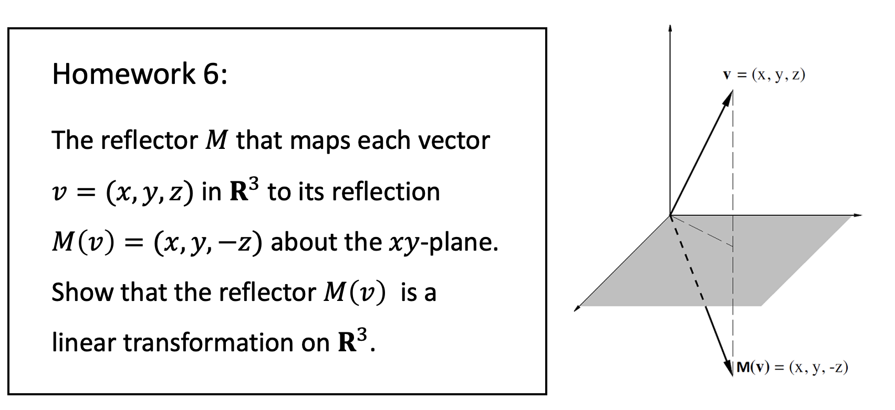
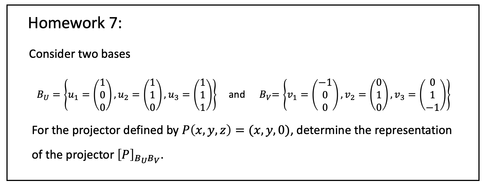

# Lecture 2 homework 6-7

`ID`:122431910061

## homework 6

The reflector $M$ that maps each vector $v=(x,y,z)$ in $\bf R^3$ to its reflection $M(v)=(x,y,-z)$ about the $xoy$ plane.

Show that the reflector $M(v)$ is a linear transformation on $\bf R^3$

$$
\begin{bmatrix}
x'\\y'\\z'\\
\end{bmatrix}=
\begin{bmatrix}
1&0&0\\
0&1&0\\
0&0&-1\\
\end{bmatrix}
\begin{bmatrix}
x\\y\\z\\
\end{bmatrix}
$$
$\implies$$Q(u)=Au$
$$
Q(\alpha u_1+\beta u_2 +\gamma u_3)=A(\alpha u_1+\beta u_2 +\gamma u_3)=\alpha Q(u_1)+\beta Q(u_2)+\gamma Q(u_3)
$$
so the reflector $M(v)$ is a linear transformation on $\bf R^3$.

## homework 7

for $B_u$
$$
P(u_1)=\begin{bmatrix}1\\0\\0\end{bmatrix}=1u_1+0u_2+0u_3\\
P(u_2)=\begin{bmatrix}1\\1\\0\end{bmatrix}=0u_1+1u_2+0u_3\\
P(u_3)=\begin{bmatrix}1\\1\\0\end{bmatrix}=0u_1+1u_2+0u_3\\
[P]_{Bu}=\begin{bmatrix}1&0&0\\0&1&0\\0&1&0\\
\end{bmatrix}
$$
for $B_v$
$$
P(v_1)=\begin{bmatrix}-1\\0\\0\end{bmatrix}=1v_1+0v_2+0v_3\\
P(v_2)=\begin{bmatrix}0\\1\\0\end{bmatrix}=0v_1+1v_2+0v_3\\
P(v_3)=\begin{bmatrix}0\\1\\0\end{bmatrix}=0v_1+1v_2+0v_3\\
[P]_{Bv}=\begin{bmatrix}1&0&0\\0&1&0\\0&1&0\\
\end{bmatrix}
$$
so
$$
P_{BuBv}=\begin{bmatrix}1&0&0\\0&1&0\\0&0&1\end{bmatrix}
$$
