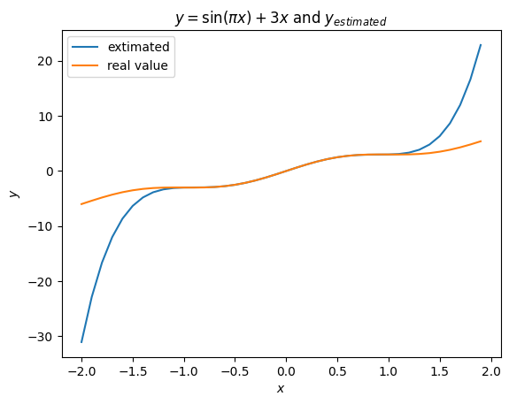
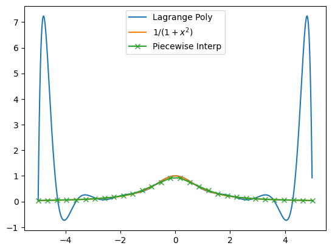

# Chapter 2

Name: Liu Zhaohong

Student ID: 122431910061

## Exercise 2.1

Given the following 4 data points

$$
\lbrace (0,1), (1,2), (3,6), (5,7) \rbrace
$$

find a polynomial in Lagrange form to interpolate these data

we know that the formula for Lagrange interpolaiton is:

$$
L_{n,k}(x) = \prod_{i = 0, i \neq k}^n \frac{x-x_i}{x_k-x_i}
$$

so the Lagrange polynomial for the 4 points should be:

$$
\begin{align}
\mathcal{L_0} & = -\cfrac{-15+23x-9x^2+x^3}{15}\\
\mathcal{L_1} & = \cfrac{15x-8x^2+x^3}{4}\\
\mathcal{L_2} & = -\cfrac{5x-6x^2+x^3}{2}\\
\mathcal{L_3} & = \cfrac{7(3x-4x^2+x^3)}{40}\\
\end{align}
$$

so the final polynomial should be sum of the 4 equations:

$$
\mathcal{L} = 1+\frac{29x}{120} + \frac{9x^2}{10} - \frac{17x^3}{120}
$$

## Exercise 2.5

Consider a function $f(x)=\sin(\pi x)+3x$ at 6 distinct nodes in the interval $[-1, 1]$ to determine the Newton's divided difference formula. The data are given in Table below:

| $x$    | -1.0 | -0.6    | -0.2    | 0.2    | 0.6    | 1.0  |
| ------ | ---- | ------- | ------- | ------ | ------ | ---- |
| $f(x)$ | -3.0 | -2.7511 | -1.1878 | 1.1878 | 2.7511 | 3.0  |

the whole coefficient matrix can be presented below:

$$
\begin{bmatrix}
p=0 & p=1 & p=2 & p=3 & p=4 & p=5\\
-3         \\
 -2.7511   &   0.62225      \\
 -1.1878   &   3.90825   &  4.1075   \\
  1.1878    &  5.939  &     2.5384375 & -1.30755208  \\
  2.7511  &  3.90825  &  -2.5384375 & -4.23072917 &-1.82698568 \\
  3 &  0.62225 &   -4.1075  &   -1.30755208 & 1.82698568 & 1.82698568
\end{bmatrix}
$$

according to the Newton's divided difference formula,

$$
P_n(x) = F_{0,0} + \sum_{i=1}^n F_i \prod_{j=0}^{i-1}(x-x_j)
$$

so the polynomial should be:

$$
\begin{align}
P(x) =& -3\\
      & +0.62225(x+1.0)\\
      & +4.1075(x+1.0)(x+0.6)\\
      & -1.30755208(x+1.0)(x+0.6)(x+0.2)\\
      & -1.82698568(x+1.0)(x+0.6)(x+0.2)(x-0.2)\\
      & +1.82698568(x+1.0)(x+0.6)(x+0.2)(x-0.2)(x-0.6)
\end{align}
$$

compare the polynomial we get and the real function $f(x)=\sin(\pi x)+3x$

we can see that **inside** the interval $[-1,1]$, the polynomial performs well, but the error will exceed greatly **beyond** the interval.

## Exercise 2.6

Construct an approximating polynomial for the following data using Hermite interpolation with Newton's forward difference

Table 1:

| $x$     | 0.1         | 0.2         | 0.3         | 
| ------- | ----------- | ----------- | ----------- | 
| $f(x)$  | -0.29004996 | -0.56079734 | -0.81401972 | 
| $f'(x)$ | -2.8019975  | -2.6159201  | -2.9734038  | 

Table 2:

| $x$     | -1.0       | -0.5       | 0.0        | 0.5        |
| ------- | ---------- | ---------- | ---------- | ---------- |
| $f(x)$  | 0.86199480 | 0.95802009 | 1.0986123  | 1.2943767  |
| $f'(x)$ | 0.15536240 | 0.23269654 | 0.33333333 | 0.45186776 |

for data in Table 1:

$$
\begin{matrix}
z_0 = 0.1\\
z_1 = 0.1\\
z_2 = 0.2\\
z_3 = 0.2\\
z_4 = 0.3\\
z_5 = 0.3\\
\end{matrix}
\quad
\begin{matrix}
f[z_0] = -0.29004996\\
f[z_1] = -0.29004996\\
f[z_2] = -0.56079734\\
f[z_3] = -0.56079734\\
f[z_4] = -0.81401972\\
f[z_5] = -0.81401972\\
\end{matrix}
\quad

\begin{matrix}
  -0.29004996  \\
  -0.29004996   & -2.8019975      \\
  -0.56079734 &   -2.7074738    &  0.945237 \\
  -0.56079734  &  -2.6159201    &  0.915537   &   -0.297\\
  -0.81401972  &  -2.5322238   &   0.836963    &  -0.39287& -0.47935\\
  -0.81401972  &  -2.9734038   &  -4.4118   &    -52.48763&
   -260.4738   &  -1299.97225   \\
\end{matrix}
$$
for data in Table 2:
$$
\begin{matrix}
0.8619948 \\
0.8619948  & 0.1553624 \\
0.95802009 & 0.19205058 & 0.07337636 \\
0.95802009  &0.23269654 & 0.08129192 & 0.01583112\\
1.0986123  & 0.28118442 & 0.09697576 & 0.01568384 &-0.00014728 \\
1.0986123  & 0.33333333 & 0.10429782 & 0.01464412 &-0.00103972 &-0.00089244\\
1.2943767 &  0.3915288 &  0.11639094 & 0.01209312 &-0.002551  & -0.00100752  &-0.00007672\\
1.2943767  & 0.45186776 & 0.12067792 & 0.00857396& -0.00351916 &-0.00096816  & 0.00002624  &0.00006864\\
 \end{matrix}
$$
so the polynomial 1 should be:
$$
\begin{align}
P(x)=
& -0.29004996\\
& -2.8019975(x-0.1)\\
& +0.945237(x-0.1)^2\\
& -0.297(x-0.1)^2(x-0.2)\\
& -0.47935(x-0.1)^2(x-0.2)^2\\
& -1299.97225(x-0.1)^2(x-0.2)^2(x-0.3)\\
\end{align}
$$
the polynomial 2 should be:
$$
\begin{align}
P(x)=
&0.8619948\\
&+0.1553624(x+1)\\
&+0.07337636(x+1)^2\\
&+0.01583112(x+1)^2(x+0.5)\\
&-0.00014728(x+1)^2(x+0.5)^2\\
&-0.00089224(x+1)^2(x+0.5)^2x\\
&-0.00007672(x+1)^2(x+0.5)^2x^2\\
&+0.00006864(x+1)^2(x+0.5)^2x^2(x-0.5)
\end{align}
$$

## Exercise 2.7

Choose equally-spaced 15 points in $[-5,5]$ and get the data points 

$$
\lbrace x_i,f(x_i) \rbrace_{i=0}^{14}
$$

by $f(x)=1/(1+x^2)$. Using piecewise linear interpolation to get the approximation of $f(x)$ in $[-5,5]$ and, compare the result with that obtained by Lagrange interpolation.

It can be seen that Lagrange interpolation keeps a good tracing trend in the center area; Piecewise interpolation keeps a good trending in all area; 
