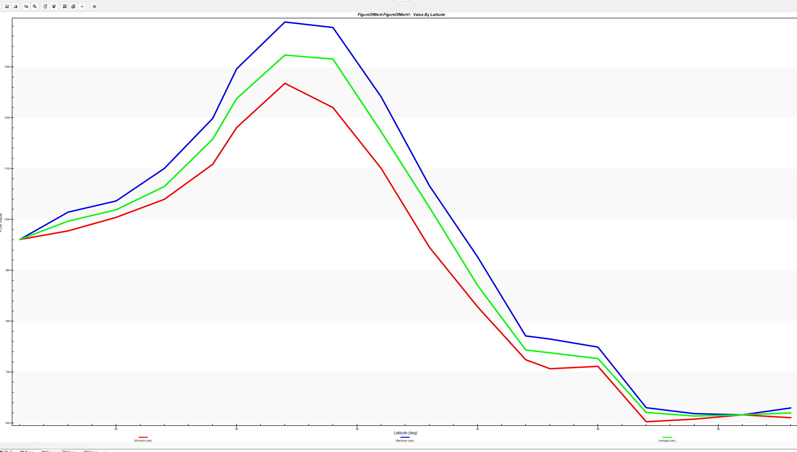
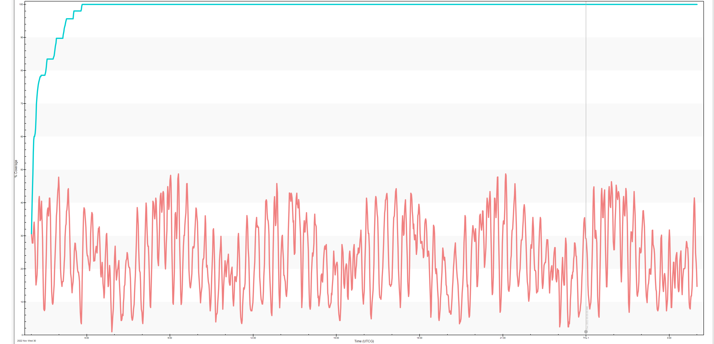
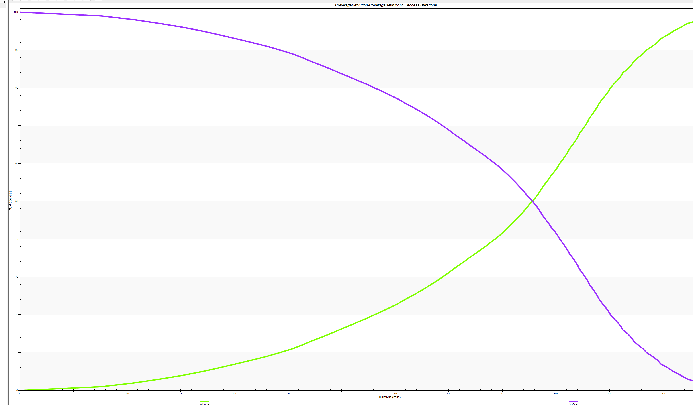

# 低轨星座设计与局部覆盖性分析

## 星座场景

| 参数       | 数值          |
| ---------- | ------------- |
| 卫星数量   | $48$          |
| 轨道面数量 | $6$           |
| 半长轴     | $8930 km$     |
| 升交点赤经 | $165^{\circ}$ |
| 偏心率     | $0.1$         |
| 近地点幅角 | $90^{\circ}$  |
| 轨道倾角   | $53^{\circ}$  |
| 真近点角   | $90^{\circ}$  |
| 视场半锥角 | $25^{\circ}$  |

## 覆盖性分析

各纬度最大重访时间

约$33^{\circ}$，各维度最大/平均重访时间达到最大值

一定时长的区域覆盖率

可以看出，大约于$7$分钟左右，覆盖率达到$100\%$